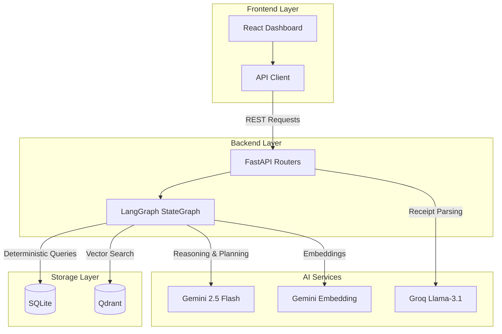

# HomeOS

**Household Inventory and Meal Planning System**

HomeOS is a hybrid multi-agent application designed to help households reduce food waste, optimize grocery spending, automate meal planning, and maintain accurate pantry inventories. Built with a focus on reliability and explainability, it combines deterministic data processing with targeted generative AI to deliver practical, everyday value.

---

## 📌 Problem Statement

Modern household management faces several recurring inefficiencies:
- **Food Waste**: Over 30% of purchased food is discarded due to poor planning and forgotten expiry dates.
- **Budget Overruns**: Families exceed financial targets by purchasing duplicate items or ignoring active pantry inventory.
- **Manual Overhead**: Tracking food consumption, scaling recipes, and manually logging grocery receipts is tedious and error-prone.
- **Fragmented Tools**: Existing solutions are either passive inventory trackers, uncontextualized recipe generators, or retroactive budget logs.

---

## 📌 Core Objectives

- **Minimize Spoilage**: Prioritize near-expiry items in meal planning.
- **Budget Control**: Validate cost estimates against user-defined limits before finalizing plans.
- **Explainability**: Provide clear, step-by-step visual tracking of system decisions.
- **Frictionless Input**: Automate inventory restocking via unstructured receipt text parsing.

---

## 📌 Key Features

### 1. Multi-Agent Meal Planning
Generates structured 3-day meal schedules (Breakfast, Lunch, Dinner) based on available inventory, family size, budget constraints, and historical meal preferences.

### 2. Semantic Recipe Retrieval (RAG)
Uses vector embeddings to search a local recipe database, ensuring the AI only suggests meals that can be made with current or easily acquirable ingredients, preventing hallucinations.

### 3. Dynamic Inventory Management
Automatically deducts ingredients when a meal is marked as complete, scaling quantities based on family size. Prevents duplicate deductions via database-level unique constraints.

### 4. Receipt Ingestion & Parsing
Accepts raw text from scanned receipts. The system extracts items, cleans quantity formats (e.g., `"5kg"` → `5.0`), converts units where necessary, and updates the pantry inventory.

### 5. Self-Correction & Reflection Loop
A dedicated validation step checks generated plans against budget limits and perishable timing rules. If a plan fails validation, the system automatically triggers a replanning loop (capped at 1 retry for performance).

### 6. Explainable Execution Traces
Every step of the planning process is logged, allowing users to view exactly how the system arrived at its recommendations (inputs, decisions, and outputs per agent).

---

## 📌 System Architecture

HomeOS uses a hybrid client-server architecture, balancing deterministic speed with advanced reasoning.



---

## 📌 Agent Workflow

The core logic is orchestrated via a LangGraph state machine, ensuring structured, predictable execution:

1. **Coordinator**: Fetches recent meal history to prevent repetitive scheduling.
2. **Inventory**: Identifies current stock levels and flags near-expiry items.
3. **Waste Analysis**: Calculates spoilage risk based on historical data and expiry dates.
4. **Recipe Retrieval**: Queries Qdrant for semantically relevant recipes, prioritizing urgent ingredients.
5. **Meal Planner**: Invokes the LLM to assemble a 3-day schedule from the candidate recipes.
6. **Budget**: Maps plan ingredients to a pricing database to calculate estimated costs and generate shopping lists.
7. **Reflection**: Validates the plan against budget and waste constraints. Returns `PASS` or `FAIL`.
8. **Reporting**: Formats the final output and saves the execution trace and plan to disk.

---

## 📌 Technology Stack

| Category | Technologies |
| :--- | :--- |
| **Frontend** | React (v18), Vite, TailwindCSS, Lucide React |
| **Backend** | Python (v3.12), FastAPI, Uvicorn, LangGraph |
| **AI / ML** | Google Gemini 2.5 Flash, Gemini Embeddings, Groq (Llama-3.1) |
| **Databases** | SQLite (Relational), Qdrant (In-Memory Vector) |

---

## 📌 API Endpoints

### Meal Planning
- `POST /api/plan/generate` – Resets execution records and triggers the LangGraph planning workflow.
- `POST /api/plan/complete-meal` – Deducts ingredients for a completed meal and logs the execution.
- `GET /api/plan/trace` – Retrieves the step-by-step agent execution log.

### Inventory & Receipts
- `GET /api/inventory` – Retrieves current structured pantry metrics.
- `POST /api/receipts` – Parses raw receipt text, extracts items, and updates inventory.
- `GET /api/receipts/inventory` – Returns a flat list of inventory items with calculated average unit prices.

---

## 📌 Installation & Setup

### Prerequisites
- Python 3.12+
- Node.js 18+
- API keys for Google Gemini and Groq

### 1. Clone the Repository
```bash
git clone <repository-url>
cd homeos
```

### 2. Backend Setup
```bash
cd backend

# Create and activate virtual environment
python -m venv .venv
source .venv/bin/activate  # On Windows: .venv\Scripts\activate

# Install dependencies
pip install -r requirements.txt

# Create environment file
cp .env.example .env
```

Edit `.env` and add your credentials:
```env
GOOGLE_API_KEY=your_gemini_api_key
GROQ_API_KEY=your_groq_api_key
```

Start the backend server:
```bash
uvicorn app:app --reload
```
*Backend will be available at:* `http://127.0.0.1:8000`  
*Swagger Documentation:* `http://127.0.0.1:8000/docs`

### 3. Frontend Setup
```bash
cd ../frontend

# Install dependencies
npm install

# Start development server
npm run dev
```
*Frontend will be available at:* `http://localhost:5173`

---

## 📌 Verification

To verify that all services are correctly configured and communicating, run the verification script in the backend directory:

```bash
python verify_ai.py
```
This script checks:
- Gemini API connectivity and embedding generation.
- Qdrant local collection initialization.
- SQLite database schema readiness.
- LangGraph workflow compilation.

---

## 📌 Future Improvements

- **Persistent Vector Storage**: Transition Qdrant from in-memory to local disk storage to eliminate startup re-indexing.
- **Distributed Caching**: Implement Redis to cache frequent recipe queries and generated meal plans.
- **Multi-User Support**: Migrate from SQLite to PostgreSQL for robust concurrent user management and role-based access.

---

## 📌 Development Team

**Team 39**  
Built for Agentrix 2026.  

---

## License

This project is intended for educational and competition use. See the `LICENSE` file for details.
